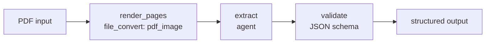

# Flows

Avalan flows define multi-step AI workflows as explicit graphs. A flow is the
right boundary when work has more structure than a single prompt: branching,
file conversion, tool calls, multiple agents, validation, or human review.

Flows keep orchestration visible. Each node has a type, inputs, outputs, and
edges to the next step.

## When to Use a Flow

Use a flow when you need to:

- Convert or prepare inputs before an agent sees them.
- Split work across multiple agents or tools.
- Branch based on previous output.
- Validate intermediate results.
- Route failures or low-confidence results.
- Add human review in task-backed or otherwise durable flows.
- Compose a repeatable workflow that can later be wrapped by a task.

If the work is a single model call, use a model or agent. If it needs durable
execution, queueing, or file delivery contracts, wrap the flow in a task.

## Flow Shape

A flow file declares nodes and edges. Native data nodes include `input`,
`constant`, `pass-through`, `select`, `validation`, `decision`, `join`, and
`notification`. Task-backed node families include `agent`, `file_convert`,
`pdf_to_images`, `tool`, `human_review`, and `subflow` where the registry and
runtime provide the required support. Domains such as databases, browser
operations, MCP calls, and code usually run through enabled tools or agents.

A typical document extraction flow:



The sample task at
[docs/examples/tasks/poc_extraction/image_flow_task.toml](examples/tasks/poc_extraction/image_flow_task.toml)
uses the flow in
[docs/examples/tasks/poc_extraction/image_flow.toml](examples/tasks/poc_extraction/image_flow.toml)
to render a PDF into page images before an extraction agent runs.

## Minimal Flow Pattern

Exact node configuration depends on the node type, but the pattern is:

```toml
[flow]
name = "profile_projection"
version = "1"

[[inputs]]
name = "payload"
type = "object"

[[outputs]]
name = "profile"
type = "object"

[entry]
type = "node"
node = "start"

[output_behavior]
type = "map"

[output_behavior.outputs]
profile = "pick.value"

[nodes.start]
type = "input"

[nodes.pick]
type = "select"

[nodes.pick.mapping.value]
type = "object"

[nodes.pick.mapping.value.fields]
name = "input.payload.name"
account_id = "input.payload.account.id"

[[edges]]
source = "start"
target = "pick"
kind = "success"
```

Use [FLOW_AUTHORING.md](FLOW_AUTHORING.md) for strict schema details and
supported node options.

Validate and run a flow directly:

```sh
avalan flow validate profile.flow.toml

avalan flow run profile.flow.toml \
    --input-json '{"name":"Ada","account":{"id":"acct_123"}}' \
    --json
```

For file inputs, use the same file flags that tasks use:

```sh
avalan flow run docs/examples/tasks/poc_extraction/image_flow.toml \
    --pdf docs/examples/tasks/poc_extraction/sample.pdf \
    --json \
    --output image.json
```

`--flow-parallel N` limits how many ready nodes can run at the same time.

## Contracts, Selectors, and Mappings

Strict flows make data movement explicit:

- `[[inputs]]` declares what callers can provide.
- `[[outputs]]` declares what the flow returns.
- Selectors read from flow inputs or prior node outputs.
- Mappings adapt those values into each node's expected input shape.

Common selectors:

| Selector | Meaning |
| --- | --- |
| `input.payload` | Flow input named `payload`. |
| `input.payload.customer.id` | Nested field under an input object. |
| `render_pages.files` | `files` output from node `render_pages`. |
| `extract.result.line_items[0]` | First line item from an extraction result. |

Prefer mappings over prompt-only assumptions. A node should not need to guess
where its inputs came from.

## Agents in Flows

Agent nodes let a flow call a full agent definition:

- The flow controls when the agent runs.
- The agent controls model, instructions, tools, and memory.
- The task, if present, controls input and output contracts.

```toml
[nodes.extract]
type = "agent"
ref = "agent.toml"
input = "input"
output = "extraction"

[nodes.extract.mapping]
input = "input.input"
```

This separation keeps each layer readable. Do not put every step into one
large agent prompt when deterministic orchestration would be clearer.

## Tools in Flows

Tool nodes are useful when the operation is explicit and should not be left
to model choice. Examples:

- Query a database before an agent drafts an answer.
- Render a PDF before a vision agent extracts fields.
- Run a search step before summarization.
- Call an MCP tool and pass the result forward.

Use agent tool access when the model should decide which tool to call. Use a
flow tool node when the workflow should always call that tool.

```toml
[nodes.calculate]
type = "tool"
ref = "math.calculator"

[nodes.calculate.mapping.arguments]
type = "object"

[nodes.calculate.mapping.arguments.fields]
expression = "input.payload.expression"

[nodes.calculate.config.arguments]
expression = "expression"
```

Tool nodes execute only through explicitly enabled tools. For the example
above, run with `--tool math.calculator` or enable the tool in the application
runtime.

Strict tool nodes can also pin a structured shell pipeline. The flow stores
the tool arguments as TOML data, not as a shell command string:

```toml
[nodes.pipeline]
type = "tool"
ref = "shell.pipeline"

[nodes.pipeline.config.arguments]
max_stdout_bytes = 1024
max_intermediate_bytes = 262144

[[nodes.pipeline.config.arguments.steps]]
id = "read"
command = "cat"
paths = ["README.md"]

[[nodes.pipeline.config.arguments.steps]]
id = "count"
command = "wc"
options = { lines = true }

[nodes.pipeline.config.arguments.steps.stdin_from]
step_id = "read"
stream = "stdout"
```

The tracked example needs a runtime that registers a `ToolManager` with
`shell.pipeline` enabled and `allow_pipelines = true`. The standalone
`avalan flow validate` command uses the default CLI flow registry and does not
accept tool-runtime flags. In the repository, the exact validation scope is:

```sh
poetry run pytest \
    tests/flow/validator_test.py::FlowValidatorTestCase::test_docs_shell_pipeline_flow_examples_validate_with_runtime \
    -q
```

Use an SDK/programmatic validator with a configured `ToolManager` when
validation must include `shell.pipeline` availability outside the test suite.

`shell.pipeline` tool nodes fail closed unless the runtime enables
`shell.pipeline` and trusted shell settings set `allow_pipelines = true`.
Byte-stream pipelines are local-only; sandbox and container byte pipelines fail
closed.

## Skills in Flows

Flows can narrow a trusted skills registry with top-level `[skills]` settings.
Agent nodes inherit the effective flow settings, and strict tool nodes that
call canonical skills tools can also use `[nodes.<name>.skills]` to narrow a
single node.

```toml
[skills]
source_labels = ["workspace-main"]
skill_ids = ["pdf"]

[nodes.read_skill]
type = "tool"
ref = "skills.read"

[nodes.read_skill.skills]
skill_ids = ["pdf"]

[nodes.read_skill.config.arguments]
skill = "pdf"
resource_id = "main"
```

Flow skills settings do not define trusted source paths. They require trusted
operator settings from SDK, host code, or a registry-backed loader. The
standalone flow CLI can enable strict tool names with `--tool skills.read`,
but it does not accept untrusted flow input as skills source authority.

Strict flow plans carry durable skills metadata. Resume revalidates that
metadata and rejects stale, widened, or policy-denied registries instead of
silently replacing the paused plan's skill authority.

The hermetic example at
[skills_read.flow.toml](examples/tasks/skills_read.flow.toml) validates with a
runtime registry built from [docs/examples/skills](examples/skills/).

## Branching and Review

Flows can route based on state or output. Common branches include:

- Low confidence to human review.
- Missing required fields to retry or fallback.
- Policy-sensitive content to approval.
- Invalid JSON to repair.
- Large files to preprocessing.

```toml
[[edges]]
source = "classify"
target = "review"
kind = "success"
priority = 1

[edges.condition]
op = "eq"
selector = "classify.value.route"
value = "review"

[[edges]]
source = "classify"
target = "approve"
kind = "success"
priority = 2
default = true
```

Human review is best handled as a workflow boundary, not as a hidden prompt
instruction. Review nodes need a durable runtime that can pause and resume
work. Task-backed runs pause at `human_review` nodes and resume by run id with
decisions keyed to the review node. See [FLOW_AUTHORING.md](FLOW_AUTHORING.md)
for authoring and review behavior.

## Mermaid Views

Mermaid diagrams can document topology or author executable edges, but the
strict TOML definition remains the execution authority. Labels, shapes, styles,
and decorative diagram nodes do not create runtime behavior.
Executable Mermaid node ids must match declared strict nodes, and executable
edges need explicit Mermaid edge ids bound through `[graph.edges.<edge_id>]`.

```toml
[graph]
format = "mermaid"
source = "file"
mode = "executable"
path = "profile_topology.mmd"
```

Compile graph-authored flows to canonical strict TOML for review or CI:

```sh
avalan flow compile docs/examples/flows/graph_file.flow.toml \
    --output strict.flow.toml

avalan flow compile docs/examples/flows/graph_inline.flow.toml --check
```

Use [FLOW_AUTHORING.md](FLOW_AUTHORING.md) for edge-id binding rules and safe
Mermaid diagnostics.

## Flows and Tasks

Tasks are often the production wrapper around flows. The task defines:

- Inputs and files.
- Size limits.
- Output schema.
- Privacy and retention behavior.
- Queue or inline execution.
- Storage and status.

The flow defines how work moves from step to step. See [TASKS.md](TASKS.md).

## Operational Guidance

- Keep node ids stable and descriptive.
- Prefer small nodes with clear inputs over one large prompt.
- Make selectors and mappings explicit; avoid hidden string concatenation.
- Add default and priority rules when more than one branch can match.
- Validate outputs at the boundary where another step depends on them.
- Keep file conversion explicit.
- Use tasks for durable execution and queues.
- Use human review for actions that should not be fully automated.
- Keep diagrams as review aids; validate the strict flow definition in CI.

## Related Documentation

- [FLOW_AUTHORING.md](FLOW_AUTHORING.md) - Full flow authoring reference.
- [FLOW_COMPATIBILITY.md](FLOW_COMPATIBILITY.md) - Runtime compatibility notes.
- [TASKS.md](TASKS.md) - Task contracts for flow execution.
- [AGENT_GUIDE.md](AGENT_GUIDE.md) - Agent nodes and model behavior.
- [TOOLS.md](TOOLS.md) - Tool nodes and tool-calling agents.
